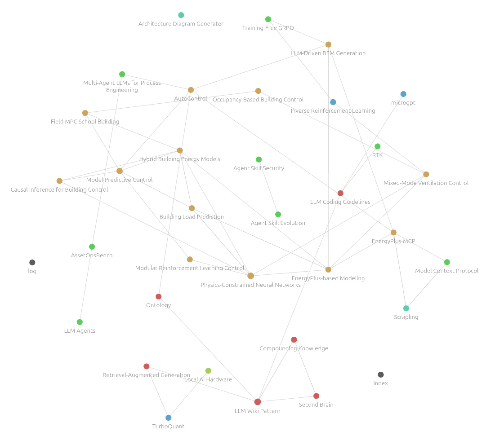

# Personal Knowledge Base Creator (v1.1.0)

A template for building your own **compounding, AI-maintained personal knowledge base** — inspired by [Andrej Karpathy's LLM Wiki pattern](https://x.com/karpathy/status/2039805659525644595). Drop in raw notes, papers, or articles and let your AI assistant (Cursor, Claude Code, or VS Code/Copilot) transform them into a structured, interlinked wiki you can explore visually in [Obsidian](https://obsidian.md).

## What You Get

- **3 AI skills** — `compile-wiki`, `ask-wiki`, and `lint-wiki` — that run directly inside your IDE
- **One-command setup** — symlink skills into your AI platform's directory, with **global** (default) or **local** scope
- **Zero external dependencies** — plain Markdown files, no databases, no vector stores, no servers
- **Obsidian-ready** — the `wiki/` folder is a pre-configured vault with graph view, backlinks, and tag pane
- **Cross-platform** — works on macOS, Linux, and Windows; supports Cursor, Claude Code, and GitHub Copilot

## How It Works

```
raw/          ← you drop source files here (papers, articles, notes, PDFs)
  │
  └─ /compile-wiki  (AI skill)
        │
        ▼
wiki/         ← AI builds and maintains this (Obsidian vault)
  │
  ├─ /ask-wiki    → query your knowledge base, get reports saved to output/
  └─ /lint-wiki   → monthly health check: fix links, merge duplicates, suggest gaps

output/       ← generated briefings and reports (gitignored, stays local)
```

Each time you run `/compile-wiki`, the AI reads only the **unprocessed** files in `raw/`, extracts concepts, creates or updates topic pages in `wiki/`, links them with `[[wiki-links]]`, and updates the index and log. Knowledge compounds with every pass.

## Quick Start

### 1. Clone and set up

**macOS / Linux** (also Git Bash or WSL on Windows):

```bash
git clone git@github.com:jlbgit/PersonalKnowledgeBaseCreator.git MyKnowledgeBase
cd MyKnowledgeBase
chmod +x setup.sh
./setup.sh cursor                # Cursor: global scope (default)
./setup.sh cursor global         # explicit global — same as above
./setup.sh claude global         # Claude Code
./setup.sh copilot global        # VS Code / GitHub Copilot
./setup.sh cursor claude global  # multiple platforms at once
```

**Windows (PowerShell)**:

```powershell
git clone git@github.com:jlbgit/PersonalKnowledgeBaseCreator.git MyKnowledgeBase
cd MyKnowledgeBase
.\setup.ps1 cursor
.\setup.ps1 cursor global
.\setup.ps1 cursor, claude global
```

**Scopes:** `global` (default) installs skills and writes `wiki-config.md` next to those skills (e.g. `~/.cursor/skills/wiki-config.md`) so paths point at this clone — use `/ask-wiki` and `/compile-wiki` from **any** open project. `local` scaffolds a wiki in the **current directory** (see [Project-local wikis](#project-local-wikis) below).

> **Windows note:** Symlinks require Developer Mode (`Settings > System > For developers`). The script falls back to copying files if unavailable — just re-run it after `git pull` to update.

> **Your data stays private.** The setup script automatically disconnects your clone from the template repository so you can't accidentally push personal content back. Your `raw/` files, `output/` reports, and any wiki pages you generate are all gitignored. To back up your knowledge base, add your own remote: `git remote add origin <your-repo-url>`.

### 2. Personalize

Open `AGENTS.md` and replace the placeholder entries in the **"My Interests / Focus Areas"** section with your own topics. This tells the AI how to cluster and link concepts as it builds your wiki.

### 3. Add your first sources

Drop any `.md`, `.pdf`, or `.txt` files into the `raw/` folder.

### 4. Compile the wiki

Open the repo in your AI assistant and say:

> *"Compile the wiki"* — or use the slash command `/compile-wiki`

### 5. Browse in Obsidian

Open the `wiki/` folder as an **Obsidian vault**. Use the Graph view to explore your knowledge network.

## Using your wiki from other projects

After `./setup.sh cursor global` (or `claude` / `copilot`), the skills read **`wiki-config.md`** next to the installed skills. It stores absolute paths to **Wiki root**, **Wiki folder**, **Raw folder**, and **Output folder** for this clone. Open any other repository in Cursor (or your assistant) and run `/ask-wiki` or `/compile-wiki` — the agent resolves your global wiki without that repo containing a `wiki/` folder.

## Project-local wikis

To keep a **separate** wiki inside another project (e.g. one codebase = one wiki), `cd` into that project and run the setup script **from your clone** of this template:

```bash
cd /path/to/YourOtherProject
/path/to/PersonalKnowledgeBaseCreator/setup.sh cursor local
```

This symlinks the skills (if needed) and creates in **that** directory: `raw/`, `output/`, `wiki/` (with starter `index.md`, `log.md`, and `.obsidian/`), `AGENTS.md`, `lint_graph.js` (so `/lint-wiki` can run with cwd set to this folder), and a **`wiki-config.md` in the project root**.

**Precedence:** if the open workspace contains `wiki-config.md` at its root, the skills use that (**local**) and ignore the global file next to the skills. Remove or rename the local file to fall back to global.

## The Three Skills

| Skill | Trigger | What it does |
|---|---|---|
| `compile-wiki` | `/compile-wiki` | Processes new `raw/` files → creates/updates wiki pages → updates index and log |
| `ask-wiki` | `/ask-wiki` | Answers questions using only your wiki → saves report to `output/` → re-integrates insights |
| `lint-wiki` | `/lint-wiki` | Health check: frontmatter validation, dangling links, orphan pages, duplicate topics, index sync, contradiction detection, new topic suggestions |

## Scale & Practical Limits

> **TL;DR:** This pattern works best with **~100 raw sources** producing **~hundreds of wiki pages** — roughly 400,000 words of compiled knowledge. Modern LLMs on the Cursor plan handle this comfortably. Beyond ~300 sources the index starts getting heavy; at 500+ you should consider batching or adding a search layer.

These numbers come directly from Karpathy's original gist — *"this works surprisingly well at moderate scale (~100 sources, ~hundreds of pages)"* — and are validated by secondary analyses that estimate the resulting wiki at roughly **400,000 words** (~500,000–550,000 tokens at ~1.3 tokens per word).

### Why the pattern doesn't need everything in one context window

The skills use an **index-first** strategy: at query or lint time the LLM reads `index.md` (a compact catalog of all pages) and then drills into the specific pages it needs. The full wiki never has to fit in context at once — only the index plus a handful of pages do. This is why 400,000 words of accumulated knowledge is achievable even on models with 200K-token windows.

### Practical limits for Cursor plan LLMs (Sonnet, Opus, GPT-5.4, Kimi, Composer…)

| Dimension | Sweet spot | Soft ceiling | What degrades |
|---|---|---|---|
| **Files per `/compile-wiki` run** | 5–15 files | ~20–30 files | Response quality and accuracy drop as the agent juggles too many new sources at once |
| **Total sources in `raw/`** (accumulated over time) | ~100 | ~200–300 | `index.md` grows large and slow to scan |
| **Single file size** | < 30,000 words (~40K tokens) | < 50,000 words (~65K tokens) | Larger files may not leave enough context for the skill instructions + wiki index |
| **Total wiki pages** | ~100–200 pages | ~300–400 pages | `index.md` starts consuming significant context, leaving less room for reasoning |

> **Individual file sizes:** Research papers (5,000–15,000 words) and web articles work perfectly. If you drop in a book, thesis, or large report, split it into chapters or sections first — anything over ~50,000 words in a single file risks crowding out the context window during compilation.

> **Batch your drops:** Rather than adding 50 files at once, add 10–20 at a time and run `/compile-wiki` between batches. The skill is designed for incremental ingestion — it tracks what has already been processed in `log.md`.

### When to consider adding search

If your wiki grows past ~300 pages and `/ask-wiki` queries feel slow or imprecise, it may be time to add a lightweight search layer (e.g. [qmd](https://github.com/tobi/qmd), which Karpathy recommends) rather than migrating to a full RAG pipeline. The underlying Markdown files stay the same — you're just adding a tool that lets the LLM pre-filter which pages to load.

## Folder Structure

```
PersonalKnowledgeBaseCreator/
├── AGENTS.md              ← AI instruction file (edit your focus areas here)
├── README.md              ← this file
├── LICENSE
├── .gitignore             ← raw/, output/, and user wiki content stay local
├── setup.sh               ← macOS/Linux installer (global | local)
├── setup.ps1              ← Windows installer (global | local)
├── lint_graph.js          ← zero-dependency graph linter (Node.js)
├── raw/                   ← drop source files here (gitignored, stays local)
├── output/                ← generated reports land here (gitignored, stays local)
├── skills/
│   ├── compile-wiki/SKILL.md
│   ├── ask-wiki/SKILL.md
│   └── lint-wiki/SKILL.md
└── wiki/                  ← Obsidian vault (AI-maintained)
    ├── index.md           ← master topic index
    ├── log.md             ← processing audit trail
    └── .obsidian/         ← pre-configured vault settings

# After setup (not in this repo — paths depend on your machine):

~/.cursor/skills/          ← symlinks to skills/ + wiki-config.md (global install)
YourOtherProject/          ← optional: wiki-config.md at repo root (local install)
```

## Examples

Once your wiki is populated, `/ask-wiki` lets you query across everything you've read. Here are some questions to try — swap in your own topics:

> *"Summarize the main approaches to building energy optimization I've collected. What gaps am I missing?"*

> *"How do multi-agent LLM systems relate to the agentic AI patterns I've been reading about?"*

> *"Which papers or sources connect Model Predictive Control to machine learning methods?"*

> *"Give me a research briefing on token optimization techniques across all my notes."*

> *"What do I know about confounding bias and causal inference? How does it connect to double machine learning?"*

Each query saves a report to `output/` and feeds new insights back into the wiki — so the knowledge base keeps compounding.

The graph below shows an example knowledge graph in Obsidian (you can also use other tools). Node colors represent topic clusters; edges are `[[wiki-links]]` extracted by the AI.



## Uninstalling

```bash
./setup.sh --uninstall cursor
# or
.\setup.ps1 -Uninstall cursor
```

This removes the skill symlinks (or copies) and the **global** `wiki-config.md` next to them. Your wiki clone and any **local** `wiki-config.md` inside other projects are untouched — delete a local `wiki-config.md` yourself if you no longer want that project to override the global wiki.

## Credits

This pattern is based on the **LLM Wiki** approach originally proposed by [Andrej Karpathy](https://x.com/karpathy/status/2039805659525644595). The core idea: use an LLM not as a search engine, but as a librarian that maintains a structured, growing knowledge graph from your raw inputs.

The implementation in this repository was also inspired by the work of [Nick Spisak](https://x.com/NickSpisak_/status/2040448463540830705) and the comprehensive [LLM Wiki tutorial by Data Science Dojo](https://datasciencedojo.com/blog/llm-wiki-tutorial/).

## License

MIT — see [LICENSE](LICENSE).

## Disclaimer

Please review the [DISCLAIMER.md](DISCLAIMER.md) file for important legal information regarding the use of this experimental software.

> *tested on Cursor only as of April 2026